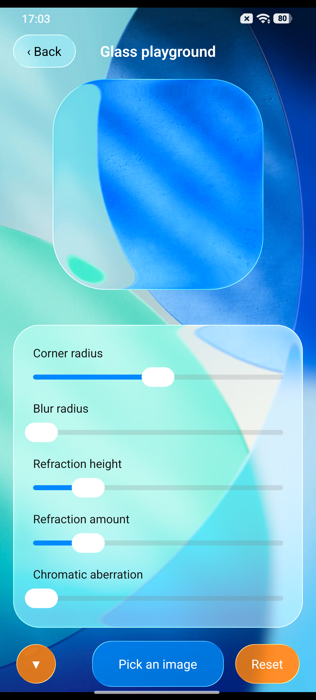

# React Native Liquid Glass Kit

Native Android liquid glass for React Native with real backdrop capture, blur,
refraction, tint, depth, chromatic dispersion, borders, and press physics.

> Android only. React Native New Architecture is required.

<p align="center">
  
</p>

## Installation

```bash
npm install react-native-liquid-glass-kit
```

Rebuild the Android application after installation. Android autolinking and
Codegen register the package automatically; no manual `MainApplication` edit is
required.

## LiquidGlassButton

Use the ready-made accessible button for standard taps. The glass background
does not steal the Pressable responder, so `onPress`, `disabled`, hit slop,
accessibility, lists, forms, and dialogs continue to behave normally.

```tsx
import React from 'react';
import {Text} from 'react-native';
import {LiquidGlassButton} from 'react-native-liquid-glass-kit';

export function SaveButton() {
  return (
    <LiquidGlassButton
      accessibilityLabel="Save changes"
      onPress={() => save()}
      glassProps={{tintColor: 'rgba(0,136,255,0.75)'}}>
      <Text style={{color: '#fff'}}>Save</Text>
    </LiquidGlassButton>
  );
}
```

`LiquidGlassButton` also accepts `contentStyle`, `pressedScale`, and all normal
React Native `PressableProps`.

## LiquidGlassView

Render a real React Native `Image` before the glass view:

```tsx
import React from 'react';
import {Image, StyleSheet, Text, View} from 'react-native';
import {LiquidGlassView} from 'react-native-liquid-glass-kit';

export function Example() {
  return (
    <View style={styles.screen}>
      <Image
        source={require('./wallpaper.webp')}
        style={StyleSheet.absoluteFill}
        resizeMode="cover"
      />

      <LiquidGlassView
        style={styles.glass}
        interactive
        cornerRadius={28}
        blurRadius={2}
        refractionStrength={0.5}
        edgeWidth={0.5}
        borderIntensity={0.5}
        saturation={1.5}
        tintColor="rgba(255,255,255,0.18)">
        <Text>Liquid Glass</Text>
      </LiquidGlassView>
    </View>
  );
}

const styles = StyleSheet.create({
  screen: {flex: 1, alignItems: 'center', justifyContent: 'center'},
  glass: {width: 220, height: 64, alignItems: 'center', justifyContent: 'center'},
});
```

### Touch ownership

- `interactive={true}` is the default. The native view owns the gesture and
  renders elastic press, drag, highlight, and spring-return physics.
- `interactive={false}` disables native interception. Use this when the glass
  is a visual layer around Buttons, Sliders, Switches, TextInputs, ScrollViews,
  or any control that must own its responder.
- Prefer `LiquidGlassButton` for ordinary accessible button behaviour.

For a custom control, place a non-interactive glass layer behind it:

```tsx
<View style={styles.control}>
  <LiquidGlassView
    interactive={false}
    pointerEvents="none"
    style={StyleSheet.absoluteFill}
    tintColor="rgba(255,255,255,0.24)"
  />
  <Slider value={value} onValueChange={setValue} />
</View>
```

## Reference presets

```tsx
// Transparent
tintColor="rgba(255,255,255,0)"

// Surface
tintColor="rgba(255,255,255,0.30)"

// Blue
tintColor="rgba(0,136,255,0.75)"

// Orange
tintColor="rgba(255,141,40,0.75)"
```

Recommended shared optics:

```tsx
cornerRadius={24}
blurRadius={2}
refractionStrength={0.5}
edgeWidth={0.5}
liquidPower={1}
borderIntensity={0.5}
saturation={1.5}
glareIntensity={0}
edgeGlowIntensity={0}
noiseIntensity={0}
```

## Android Photo Picker

The optional helper opens the system Photo Picker without storage permission:

```tsx
import {pickLiquidGlassImage} from 'react-native-liquid-glass-kit';

const uri = await pickLiquidGlassImage();
if (uri) {
  setWallpaperUri(uri);
}
```

## LiquidGlassView properties

| Property | Default | Description |
|---|---:|---|
| `interactive` | `true` | Native press and elastic drag; disable for composed controls |
| `blurRadius` | `8` | Backdrop blur radius in dp |
| `cornerRadius` | `32` | Shape radius in dp |
| `saturation` | `1` | Backdrop saturation |
| `tintColor` | white/12% | Colour wash and opacity |
| `refractionStrength` | `0.16` | Lens displacement |
| `refractionHeightFraction` | `-1` | Explicit edge height; negative uses `edgeWidth` |
| `depthEffect` | `false` | Radial depth normal |
| `chromaticAberration` | `0.04` | RGB edge dispersion |
| `edgeWidth` | `0.4` | Relative refracting-edge width |
| `liquidPower` | `1.5` | Refraction falloff |
| `borderIntensity` | `0.12` | Highlight border strength |
| `plainBorder` | `false` | Uniform instead of directional border |
| `glareIntensity` | `0.16` | Specular glare |
| `edgeGlowIntensity` | `0` | Fresnel edge glow |
| `fresnelPower` | `4` | Fresnel exponent |
| `lightAngle` | `0.8` | Glare direction in radians |
| `brightness` | `1` | Brightness multiplier |
| `noiseIntensity` | `0.01` | Frosted grain |
| `iridescence` | `0` | Rainbow edge sheen |

All standard React Native `ViewProps`, including `style` and `pointerEvents`,
are supported.

## Requirements and rendering tiers

| Requirement | Value |
|---|---|
| React Native | `>=0.76 <1.0` |
| Android min SDK | 24 |
| Recommended Android | 13+ |
| New Architecture | Required |

- Android 13+: full AGSL `RuntimeShader` optics.
- Android 12–12L: `RenderEffect` fallback.
- Android 7–11: safe raster fallback.

## Troubleshooting

### `RNLiquidGlassView was not found`

Reinstall dependencies, clean Android, and rebuild:

```powershell
npm install
cd android
.\gradlew.bat clean
cd ..
npm run android
```

### The glass is black or empty

Ensure the background `Image` has loaded, is visible, has non-zero dimensions,
and is rendered before the glass component.

## License

MIT © contributors.

Parts of the renderer are derived from MIT and Apache-2.0 projects. Required
attribution is preserved in [THIRD_PARTY_NOTICES.md](./THIRD_PARTY_NOTICES.md)
and [LICENSES](./LICENSES).
